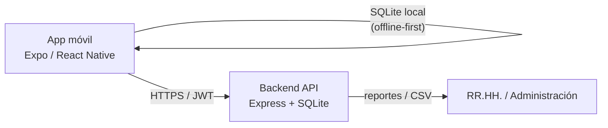

# Reloj Checador (App de asistencia con huella digital)

Aplicación móvil que funciona como reloj checador: los empleados registran su
**entrada** y **salida** confirmando su identidad con el **lector de huella
digital** (o Face ID) del celular. Los registros se guardan primero en el
dispositivo (modo *offline-first*) y se sincronizan automáticamente con un
backend propio para que RR.HH. pueda consultarlos desde cualquier lugar.

## Arquitectura

```
mobile/    App Expo (React Native) — pantalla de checado con huella digital
backend/   API REST (Node.js + Express + SQLite) — usuarios y registros
```



**Cómo funciona el checado con huella:**
1. El empleado abre la app e inicia sesión una sola vez (correo + contraseña,
   proporcionados por RR.HH.).
2. En la pantalla principal toca el botón grande de huella digital.
3. El sistema operativo (Android/iOS) pide la huella o Face ID —
   **la huella nunca sale del teléfono**, solo se usa para desbloquear el
   registro en la app (así funciona `BiometricPrompt` / `LocalAuthentication`
   en cualquier app, incluidas apps bancarias).
4. Al validarse la huella, la app guarda el registro (entrada/salida) en la
   base de datos local del teléfono y lo envía al backend. Si no hay
   internet, el registro queda pendiente y se sincroniza solo cuando vuelve
   la conexión.

## Backend — puesta en marcha

```bash
cd backend
cp .env.example .env      # ajusta JWT_SECRET y credenciales del admin
npm install
npm run seed               # crea el usuario administrador definido en .env
npm run dev                 # http://localhost:3000
```

Con el admin puedes dar de alta empleados desde `POST /api/employees`
(ver `backend/README.md` para el detalle de la API).

## App móvil — puesta en marcha

```bash
cd mobile
npm install
npx expo start
```

- Necesitas un **celular físico** (Expo Go o build de desarrollo) para
  probar la huella digital real; los emuladores no siempre traen sensor.
- Configura la URL del backend en `mobile/src/config.js`
  (`API_URL`), o exporta `EXPO_PUBLIC_API_URL` antes de `expo start`.

## Próximos pasos sugeridos

- Panel web de administración para ver reportes de asistencia.
- Notificaciones push recordando la hora de entrada/salida.
- Geocercas (geofencing) para exigir que el checado se haga desde la oficina.
- Migrar el backend de SQLite a Postgres para producción con varios
  servidores.

Cada carpeta (`backend/`, `mobile/`) tiene su propio `README.md` con más
detalle.
